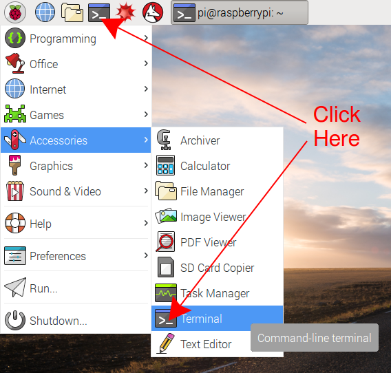

# Using a Raspberry Pi

This guide is not intended to be a full description of how to use a Raspberry Pi, but it will give you a few pointers on how to keep the software up-to-date and some of the things you can do with the computer.

## Using the terminal

When you've used computers in the past with Operating Systems like Windows or OS X, you'll have used a Graphical User Interface (GUI) to control the computer. With a GUI you use the mouse pointer to click on menus and icons. While Raspbian has a GUI, to properly use the Raspberry Pi, you'll need to learn to use the **terminal**

- Open the terminal by going to *Menu* > *Accessories* > *Terminal*, or by clicking on the terminal icon in the tool bar on the desktop.



## Keeping up-to-date
- The most important commands to learn is the command to update the software on the Raspberry Pi. To do this, you first need to update the list of software available.

``` bash
sudo apt-get update
```

- Next you can upgrade all installed software

``` bash
sudo apt-get upgrade -y
```

### A note of `sudo`
- `sudo` is short for **super user do**. It is basically running a command as an administrator. Many commands need adminstrator permission to run, so need to be typed using `sudo`.

## Other useful commands
- You can use the GUI for most things on the Raspberry Pi, but many online tutorials and guides will assume you're using a terminal, so it is best to become aquinted with a few terminal commands.

| Command     | Name             | Example                            | Description                                                        |
|-------------|------------------|------------------------------------|--------------------------------------------------------------------|
| ls          | list             | `ls`                               | list the files in the current directory                            |
| ls -a       | list all         | `ls -a`                            | list all the files including hidden ones                           |
| cd          | change directory | `cd ~/Documents`                   | change to the `Documents` directory                                |
| cd ..       | change directory | `cd ..`                            | change to the parent directory                                     |
| touch       | touch            | `touch test.txt`                   | create a file called `test.txt`                                    |
| mv          | move             | `mv test.txt ~/Documents/TEST.txt` | move the `test.txt` file to `Documents` and change its name        |
| cp          | copy             | `cp test.txt test.bak`             | copy the `test.txt` file and name it `test.bak`                    |
| rm          | remove           | `rm test.txt`                      | delete the `test.txt` file permenantly                             |
| rm -r       | recursive remove | `rm -r Documents`                  | delete the `Documents` directory and all it's contents permenantly |
| nano        | nano             | `nano test.txt`                    | Open or create the file `test.txt` for editing in nano             |
| hostname -I | hostname         | `hostname -I`                      | Display the IP address of the Raspberry Pi                         |
